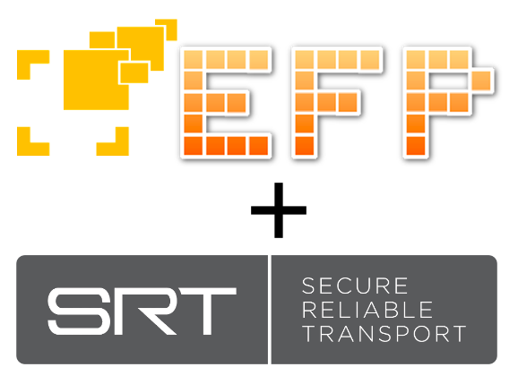
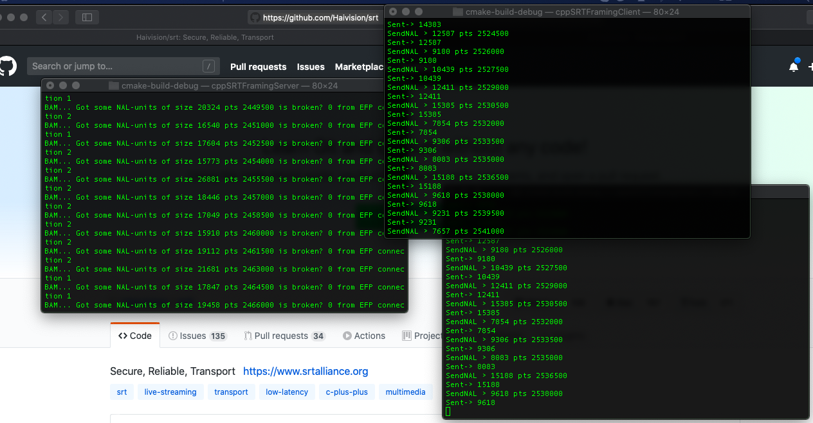

# SRT + EFP Client/Server example

This example uses EFP ([ElasticFramingProtocol](https://github.com/Unit-X/efp)) as a layer between the producer/consumer of data and the transport layer. As network protocol/transport layer SRT ([SecureReliableTransport](https://github.com/Haivision/srt)) is used.

a SRT C++ wrapper used by this example. The wrapper is located [here](https://github.com/andersc/cppSRTWrapper).

## build


**All architectures:**

```
cmake .
make
mkdir tmp
mv cppSRTFramingClient tmp/
```

**Run the system:**

```
1. Start the server 
./cppSRTFramingServer
2. then from the other terminals.
cd tmp
./cppSRTFramingClient
```

Expected result->



The server prints out information about the data recieved. If the data is broken or not meaning data loss or not in the transport layer. Then as pictured two clients connected and the server prints from what client the data came from.


 